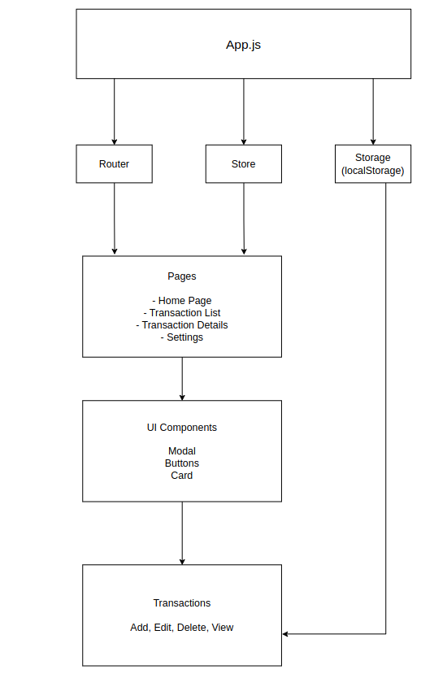

# Single Page Application: Expense Tracker

A mini Single Page Application (SPA) for managing expenses. The project uses client-side routing, reactive state management, reusable components, and localStorage persistence.

The project was originally built with JavaScript and has been incrementally migrated to TypeScript with strict type checking.

## Live Demo

https://gaureshpa.github.io/Week4-Project/

## Architecture



## Tech Stack

- TypeScript
- JavaScript
- HTML5
- CSS3
- Vite
- Vitest
- ESLint

## TypeScript Features Used

- Interfaces for application state, transactions, routes, actions, and components
- Generics such as `Store<State>` and `Queue<T>`
- Union types such as `Route | null` and `string | null`
- Optional properties
- Functional type definitions
- Type annotations and assertions where required.
- Path aliases using `@utils/*` and `@components/*`
- Strict type checking with `strict: true`
- Generic API responses through `ApiClient.get<T>()`

## Folder Structure

```text
Week4-Project/
├── src/
│   ├── components/
│   │   ├── Button.ts
│   │   ├── Card.ts
│   │   └── Modal.ts
│   ├── pages/
│   │   ├── detail.ts
│   │   ├── home.ts
│   │   ├── list.ts
│   │   └── settings.ts
│   ├── utils/
│   │   ├── ApiClient.ts
│   │   └── Queue.ts
│   ├── css/
│   │   └── style.css
│   ├── global.d.ts
│   ├── main.ts
│   ├── reducer.ts
│   ├── router.ts
│   ├── storage.ts
│   ├── store.ts
│   └── utils.ts
├── tests/
│   ├── apiClient.test.ts
│   ├── detail.test.ts
│   ├── list.test.ts
│   ├── queue.test.ts
│   ├── reducer.test.ts
│   ├── router.test.ts
│   ├── stateManager.test.ts
│   ├── storage.test.ts
│   ├── store.test.ts
│   └── utils.test.ts
├── architecture.png
├── index.html
├── package.json
├── tsconfig.json
├── vitest.config.js
└── README.md
```

## How to Run

Install dependencies:

```bash
npm install
```

Start the development server

```bash
npm run dev
```

Open the local URL provided by Vite in your browser.

## How to Test

Run all tests:

```bash
npx vitest run
```

Run test in watch mode:

```bash
npx vitest
```

Run tests with coverage:

```bash
npx vitest run --coverage
```

## How to Type-Check

Run TypeScript without generating output:

```bash
npx tsc --noEmit
```

The project should complete with zero TypeScript errors.

## Linting

Run ESLint:

```bash
npx eslint src tests
```

The goal is zero ESLint warnings and errors.

